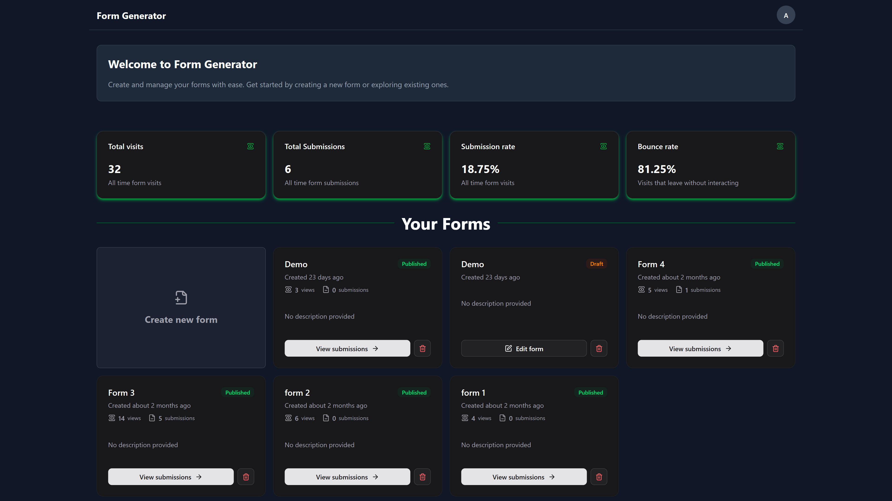

# **Form Generator**


A powerful no-code form builder application that allows users to create, customize, and deploy forms through an intuitive drag-and-drop interface. Similar to Google Forms but with enhanced flexibility and modern design.


## ✨ **Features**

### **1. Drag & Drop Form Builder**
- Intuitive visual form designer with real-time preview
- Wide variety of form elements (text fields, checkboxes, radio buttons, dropdowns, etc.)
- Easy element positioning and customization

### **2. Form Management**
- Create unlimited forms with unique identifiers
- Save forms as drafts and publish when ready
- Live preview mode to test forms before publishing
- Public shareable links for form distribution

### **3. Response Collection & Analytics**
- Real-time response tracking and analytics
- Comprehensive submission management
- Export responses in CSV and Excel formats
- Visual statistics and form performance metrics

### **4. User Authentication**
- Secure sign-up and sign-in system
- User-specific form management
- Protected form builder and analytics access

## 🚀 **Getting Started**

### Prerequisites
- Node.js (v18 or higher)
- npm or yarn package manager

### Installation

1. Clone the repository:
```bash
git clone <repository-url>
cd form-generator
```

2. Install dependencies:
```bash
npm install
# or
yarn install
```

3. Start the development server:
```bash
npm run dev
# or
yarn dev
```

4. Open [http://localhost:3000](http://localhost:3000) in your browser

## 🏗️ **Project Structure**

```
src/
├── app/                    # Next.js app router pages
│   ├── (auth)/            # Authentication pages
│   ├── builder/[id]/      # Form builder interface
│   ├── forms/[id]/        # Form management and analytics
│   └── submit/[formURL]/  # Public form submission pages
├── components/
│   ├── builder/           # Form builder components
│   ├── dashboard/         # Dashboard and form list
│   ├── fields/            # Form field components
│   ├── forms/             # Form management components
│   ├── layouts/           # Page layout components
│   ├── navbar/            # Navigation components
│   ├── submit/            # Form submission components
│   └── ui/                # Reusable UI components
├── context/               # React context providers
├── hooks/                 # Custom React hooks
├── lib/                   # Utility libraries
├── types/                 # TypeScript type definitions
└── validations/           # Form validation schemas
```

## 🛠️ **Technology Stack**

- **Framework**: Next.js with TypeScript
- **Styling**: Tailwind CSS + shadcn/ui components
- **State Management**: React Context API
- **Form Handling**: React Hook Form with Zod validation
- **Drag & Drop**: React DnD
- **HTTP Client**: Axios

## ⭐ **Core Functionality**

### **1. Form Builder**
- **Designer**: Visual drag-and-drop interface for form creation
- **Element Library**: Text fields, email fields, checkboxes, radio buttons, select dropdowns, text areas, and more
- **Properties Panel**: Customize field properties, validation rules, and styling
- **Live Preview**: Test forms in real-time before publishing

### **2. Form Management**
- **Dashboard**: Overview of all created forms with statistics
- **Form Cards**: Quick access to form analytics and sharing options
- **Submission Table**: View and manage form responses
- **Export Options**: Download responses as CSV or Excel files

### **3. Public Form Access**
- **Shareable Links**: Generate public URLs for form distribution
- **Responsive Design**: Forms work seamlessly on desktop and mobile devices
- **Submission Handling**: Collect and store user responses securely

## 🎯 **Usage**

1. **Sign Up/Sign In**: Create an account or log in to access the form builder
2. **Create Form**: Click "Create Form" to start building your form
3. **Design**: Drag and drop elements from the sidebar to build your form
4. **Customize**: Use the properties panel to configure field settings
5. **Preview**: Test your form using the preview feature
6. **Publish**: Make your form live and get a shareable link
7. **Collect**: Share the link and start collecting responses
8. **Analyze**: View submissions and download response data

## 🔧 **Configuration**

The application uses several configuration files:
- `next.config.ts` - Next.js configuration
- `tailwind.config.js` - Tailwind CSS configuration
- `components.json` - shadcn/ui component configuration
- `tsconfig.json` - TypeScript configuration

## 📊 **Available Form Elements**

- **Text Field** - Single-line text input
- **Email Field** - Email validation input
- **Number Field** - Numeric input with validation
- **Text Area** - Multi-line text input
- **Checkbox** - Single or multiple checkboxes
- **Radio Button** - Single selection options
- **Select Field** - Dropdown selection
- **Title Field** - Form section titles
- **Subtitle Field** - Form section subtitles
- **Paragraph Field** - Descriptive text blocks
- **Separator** - Visual section dividers

## 💡 Concept & Ideation

This Form Generator project was conceptualized and envisioned by:

 **[Bharat Panigrahi](https://github.com/Bharat1056)** - Original concept, project vision, and feature planning


The idea emerged from the need for a modern, intuitive no-code form builder that combines the simplicity of drag-and-drop interfaces with powerful analytics and response management capabilities.

## 👥 **Collaborators**

We thank the following people who have contributed to this project:

| Avatar | Name | Role | GitHub |
|--------|------|------|--------|
|  | [Dharmendra Mahanta](https://github.com/dharmendra-007) | Full Stack Developer | [@dharmendra-007](https://github.com/dharmendra-007)
|  | [Sonakshi Pradhan](https://github.com/PSonakshi) | Frontend Developer | [@PSonakshi](https://github.com/PSonakshi)
|  | [Gyanranjan Patra](https://github.com/Gyannnnn) | Backend Developer | [@Gyannnnn](https://github.com/Gyannnnn)
|  | [Subhankar Patra](https://github.com/subhankar2004) | Frontend Developer | [@subhankar2004](https://github.com/subhankar2004)


*Want to see your name here? Check out the contributing section below!*

## 🤝 **Contributing**

1. Fork the repository
2. Create a feature branch (`git checkout -b feature/amazing-feature`)
3. Commit your changes (`git commit -m 'Add some amazing feature'`)
4. Push to the branch (`git push origin feature/amazing-feature`)
5. Open a Pull Request

## 📄 **License**

This project is licensed under the MIT License - [**LICENSE**](./LICENSE)

## 🆘 **Support**

For support and questions:
- Create an issue in the GitHub repository
- Check the documentation
- Review existing issues for solutions

---

Built with 💚 by [**Enigma**](https://enigmavssut.in/) .